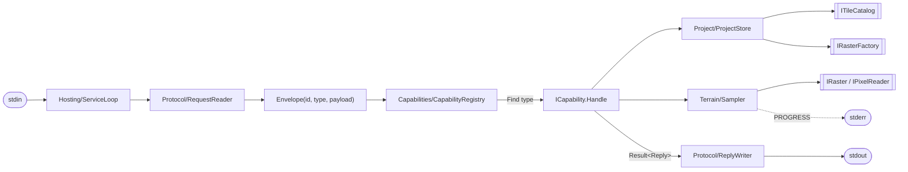
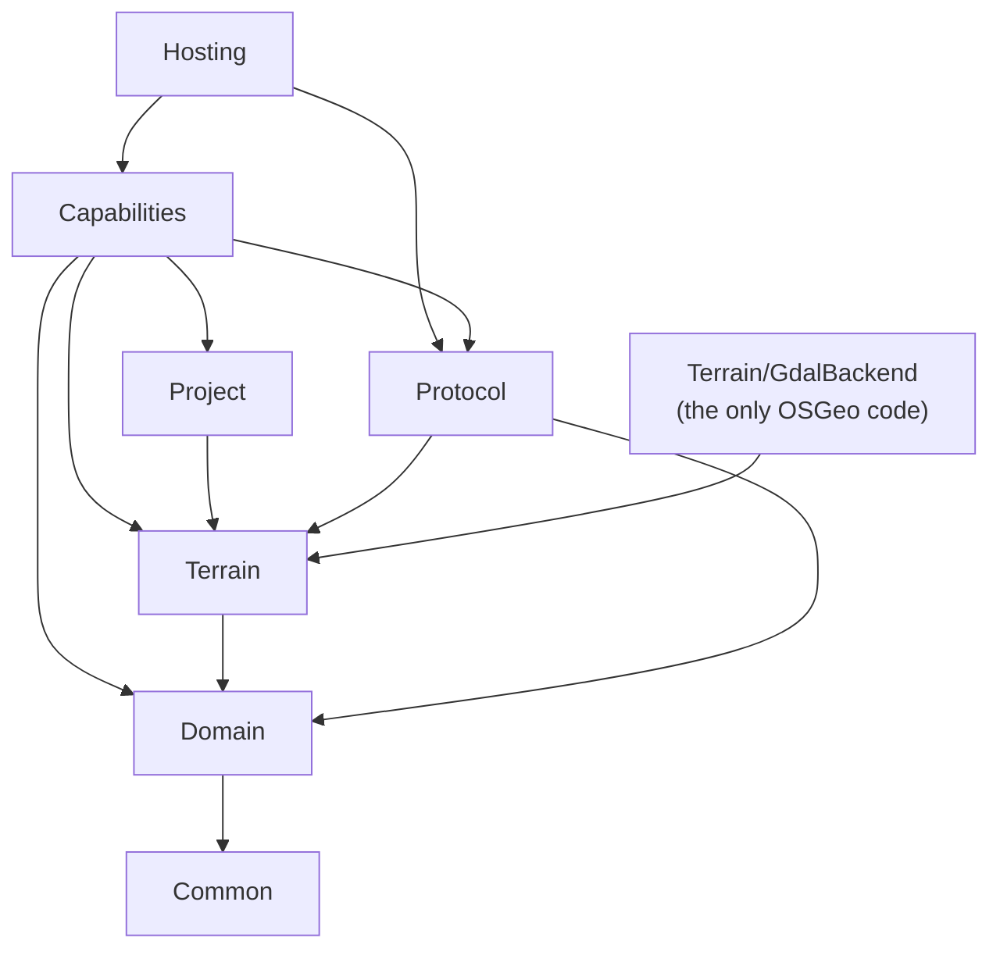

# GDALService

A stand-alone process that samples terrain heights from a project's GeoTIFF tiles.
Clients start it and speak JSON lines on stdin/stdout. Any language that can start a
process and read and write lines can use it. It needs no .NET: the publish is
self-contained.

Current clients: DimensioneringV2 (C#, net8) and the NorsynDrawingTools plugin (C++).

## Build, test, publish

It needs the .NET 11 SDK. `global.json` pins it, so an older `dotnet` fails with a clear message.
Run these from `Acad-C3D-Tools`:

```powershell
dotnet build GDALService.Tests            # warnings are errors, analyzers on
dotnet test  GDALService.Tests            # unit, rule, golden and end-to-end tests
dotnet publish GDALService -p:PublishProfile=FolderProfile   # self-contained, win-x64
```

`FolderProfile` publishes straight to the shared deploy folder. Publish somewhere else
to try a build first:

```powershell
dotnet publish GDALService -p:PublishProfile=FolderProfile -p:PublishDir=<scratch>
```

## Wire protocol

One request per line on stdin, one reply per line on stdout, strictly in turn.

```jsonc
// request
{"id":"42","type":"SAMPLE_POINTS","payload":{"points":[{"geomId":7,"seq":0,"s":0,"x":1002.5,"y":2008.5}]}}
// success
{"id":"42","status":0,"result":{"total":1,"ok":1,"outside":0,"noData":0,"err":0,"rows":[{"geomId":7,"seq":0,"s":0,"x":1002.5,"y":2008.5,"elev":102.5,"status":"OK"}]}}
// failure
{"id":"42","status":4,"error":"No project initialized. Call SET_PROJECT first always!"}
```

| `status` | Meaning |
|---|---|
| 0 | OK, `result` is present |
| 1 | GDAL failure or internal error |
| 2 | Invalid request (bad JSON, missing or mistyped field, unknown type) |
| 3 | Not found (folder, tiles) |
| 4 | No project open yet |

A line whose `id` cannot be read is answered with no `id` at all.

| `type` | Payload | Result |
|---|---|---|
| `HELLO` | any | `{msg:"HELLO_ACK"}` |
| `SET_PROJECT` | `{projectId, basePath}` | `{projectId, elevationsDir, vrtPath, width, height, bands, projection?}` |
| `SAMPLE_POINTS` | `{points:[{geomId, seq, s, x, y}]}` | summary + `rows` in request order, `elev` only when `status` is `OK` |
| `SAMPLE_GRID` | `{gridDist}` | summary + `rows` of `OK`/`NODATA` cells, `z` only when `OK` |
| `SHUTDOWN` | any | `{msg:"BYE"}`, and the process exits |

A row's `status` is one of `OK`, `NODATA`, `OUTSIDE` or `ERR`. Tiles are
`<basePath>\Elevations\<projectId>_<n>.tif`. They are mosaicked in memory, so nothing
is written to the tile folder.

stderr carries `READY gdal=<version>` (or `READY without GDAL: <reason>`) at start-up,
`PROGRESS` lines while sampling, and `WARN`/`BUG` diagnostics:

```json
{"id":"g","type":"PROGRESS","done":500,"total":861,"pct":58.07200929152149}
```

The golden transcript `GDALService.Tests/Golden/*.verified.txt` is the full example
session. A test fails if the wire changes by one byte. The only exceptions are the
temp paths, which are masked.

## Architecture

The loop knows no request type by name. Every request type is a **capability**: one
class that reads its own payload, does its own work and writes its own reply.



`[[double boxes]]` are the interfaces at the I/O boundaries. `FileSystemTileCatalog`
implements the catalog. `Terrain/GdalBackend` implements the raster ones. Tests swap
in the fakes under `GDALService.Tests/Fakes`.

Which folder may use which (every folder also uses `Common`):



| Folder | Holds |
|---|---|
| `Common` | `Result<T>` / `Option<T>` unions and their `Bind`/`Map`/`Switch`, `ServiceLog` |
| `Domain` | the `Sample` union (`Elevation`, `NoData`, `Outside`, `ReadFailed`) and the query/row records |
| `Protocol` | reading an `Envelope`, writing a reply, shared JSON readers and writers, progress |
| `Capabilities` | `ICapability`, the registry, and one file per request type |
| `Terrain` | `Sampler`, the raster interfaces, and `GdalBackend` behind them |
| `Project` | `ProjectStore` (the open project) and the tile catalog |
| `Hosting` | the loop and its streams |
| `ServiceComposition.cs` | the whole object graph (Microsoft.Extensions.DependencyInjection) |

### Rules the tests enforce

`GDALService.Tests/SourceRulesTests.cs` parses every source file with Roslyn and fails the build's tests on:

- **Null and exceptions as control flow.** There is no `!`, no `goto`. `null` and `catch`
  appear only in the edge files (`GdalEdge`, `GdalBootstrap`, `JsonEdge`,
  `FileSystemTileCatalog`, `StreamEdge`) and in the one guard in `ServiceLoop`. An
  expected failure is a `Fault` inside a `Result<T>`.
- **Unions matched only by switch expressions**, never by `is`/`as` or a switch
  statement, and never with a `_` arm. A new case then breaks the build everywhere it
  must be handled.
- **Boundaries.** OSGeo is used only under `Terrain/GdalBackend`. `File`/`Directory` are
  used only in `FileSystemTileCatalog.cs`. A capability never names another capability.
  `Domain` and `Common` depend on nothing else in the service.

The build also runs the .NET analyzers at `latest-recommended`, with warnings as errors.
The house style is in `Acad-C3D-Tools/.editorconfig`.

## How to add a capability

Two edits: one new file, and one line in `ServiceComposition.cs`. No other file of the
service changes, and no test needs editing. Example: `LIST_TILES {max}` returns the open
project's tile names.

**1. Write `Capabilities/ListTiles.cs`.**

```csharp
using System.Text.Json;

using GDALService.Common;
using GDALService.Project;
using GDALService.Protocol;

namespace GDALService.Capabilities;

// LIST_TILES {max}: the file names of the open project's tiles, at most `max`
// of them, and how many there are in all.
internal sealed class ListTiles : ICapability
{
    private readonly ProjectStore _projects;

    public ListTiles(ProjectStore projects) { _projects = projects; }

    public string Type => "LIST_TILES";

    public Result<Reply> Handle(Envelope request) =>
        JsonRead.Payload(request)
            .Bind(payload => JsonRead.Required(payload, "max", JsonEdge.Int32, "an integer"))
            .Bind(max => _projects.Current.Bind(open =>
                Reply.Continue(new Listed(open.ProjectId, open.Tiles.Tiles, max))));

    private sealed record Listed(string ProjectId, IReadOnlyList<TileFile> Tiles, int Max) : IReplyBody
    {
        public void WriteTo(Utf8JsonWriter json)
        {
            json.WriteString("projectId", ProjectId);
            json.WriteNumber("total", Tiles.Count);
            json.WriteStartArray("tiles");
            foreach (var tile in Tiles.Take(Max))
            {
                json.WriteStringValue(Path.GetFileName(tile.Path));
            }
            json.WriteEndArray();
        }
    }
}
```

- **`Type`** is the wire's `type`, matched exactly. Two capabilities with the same type
  stop the service at start-up with a `BUG` line.
- **Constructor parameters** are supplied by the container. You can ask for
  `ProjectStore`, `Sampler`, `ProgressFactory`, `ServiceLog`, `SamplingOptions`,
  `ITileCatalog` or `IRasterFactory`.
- **`Handle`** returns a `Result<Reply>`, and each step is a `Bind`. The first `Fault`
  ends the chain and becomes the error reply:
  - `JsonRead.Required` gives `'max' is missing` or `'max' must be an integer` (status 2).
  - `_projects.Current` gives status 4 when no project is open.
  
  Never throw, and never return `null`.
- **The reply body** writes the members of `result`. `Reply.Stop(...)` instead of
  `Reply.Continue(...)` ends the service after the reply.

**2. Register it** in `ServiceComposition.Build`:

```csharp
            .AddCapability<Shutdown>()
            .AddCapability<ListTiles>();
```

That is all. The tests then check the new capability automatically:

- `SourceRulesTests` applies every rule to the new file.
- `CapabilityRegistryTests.Every_capability_in_the_service_is_registered_by_the_composition`
  fails if you forget step 2.

Add tests of its own next to `CapabilityTests.cs`: call `Handle` with an `Envelope`,
using the fakes. `PluginProofTests` shows the same pattern end to end with a capability
defined only in the test project.
