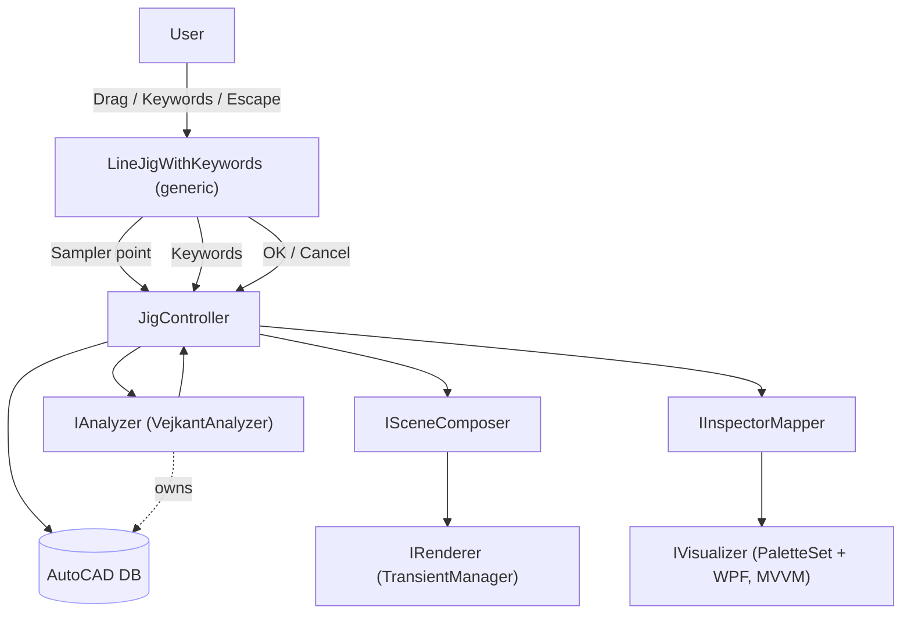
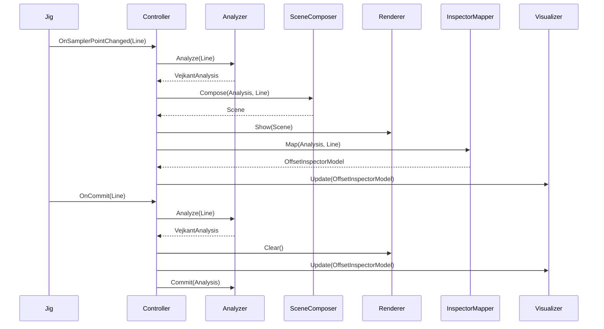

## Vejkant Offset — Continuous Jig, Live Analysis, and MVVM UI

This document is the single source of truth for the continuous jig workflow, live offset preview, and WPF visualization for Vejkanter analysis. It is designed to be LLM-friendly: concise sections, clear contracts, and diagrams.

### Core goals
- Keep the jig generic and reusable; do not create a new jig type dedicated to Vejkanter.
- Add continuous operation: every committed end point seeds the next segment start.
- On every sampler move, run `VejKantAnalyzerOffsetter` and show a live offset preview via AutoCAD Transient graphics.
- First Escape returns to “Select first point”; second Escape exits.
- Provide a WPF MVVM visualizer that remains domain-agnostic; Vejkant-specific logic stays in analyzer and mappers.
- Encapsulate Vejkant-specific logic in `VejkantOffset/` and keep `Jigs/LineJigWithKeywords<TContext>` task-agnostic.

---

### High-level architecture



Key principle: Renderer and Visualizer are domain-agnostic. Only the Analyzer and Composers/Mappers are Vejkant-specific.

---

### Responsibilities and contracts

- Jig: `LineJigWithKeywords<TContext>` (existing, generic)
  - Provides a continuous workflow by reusing the end point as the next start point.
  - Exposes extensibility via optional callbacks (no Vejkant dependencies):
    - `OnSamplerPointChanged(Line line)`
    - `OnKeyword(string keyword)`
    - `OnCommit(Line line)` — user confirms end point
    - `OnCancelLevel1()` — return to start-point prompt
    - `OnCancelLevel2()` — exit jig

- Controller: `JigController<TAnalysis, TInspectorModel, TContext>` (generic)
  - No DB access; orchestrates services.
  - On sampler tick: `Analyze(Line)` → `SceneComposer.Compose` → `IRenderer.Show`; `IInspectorMapper.Map` → `IVisualizer.Update`.
  - On commit: repeats analyze, clears renderer, updates visualizer, then `IAnalyzer.Commit`.
  - On cancel: clears preview or hides UI.

- Analyzer: `IAnalyzer<Line, VejkantAnalysis>` → `VejkantAnalyzer`
  - Constructed with DBs and settings.
  - Returns domain result `VejkantAnalysis`; owns `Commit` to DB.

- Rendering (domain-agnostic)
  - `Scene`, `IRenderable`, `IRenderVisitor`, primitives: `Line2D`, `Arc2D`, `PolyPath2D`, `Style`.
  - `IRenderer.Show(Scene)`, `Clear()`.

- Visualization (domain-agnostic)
  - `IVisualizer<TInspectorModel>`.
  - Vejkant UI model: `OffsetInspectorModel`.
  - Mapper: `IInspectorMapper<VejkantAnalysis, OffsetInspectorModel>`.

---

### Proposed folder structure (all Vejkant-specific under `VejkantOffset/`)

```
VejkantOffset/
  App/
    OffsetJigController.cs (JigController<TAnalysis,TInspectorModel,TContext>)
    Contracts/
      IOffsetAnalyzer.cs (IAnalyzer<,>, ISceneComposer<>, IInspectorMapper<,>)
      ITransientRenderer.cs (IRenderer)
      IWpfVisualizer.cs (IVisualizer<TModel>)
  Core/
    Analysis/
      VejKantAnalyzerOffsetter.cs
    Models/
      SegmentHit.cs
      VejkantAnalysis.cs
    Settings/
      VejkantOffsetSettings.cs
  Rendering/
    Scene.cs (Scene, IRenderable, IRenderVisitor, Line2D, Arc2D, PolyPath2D, Style)
    TransientPreviewRenderer.cs
    VejkantSceneComposer.cs
  UI/
    Models/
      OffsetInspectorModel.cs
    VejkantInspectorMapper.cs
    Views/
      OffsetPaletteView.xaml
      OffsetPaletteView.xaml.cs
    ViewModels/
      OffsetPaletteViewModel.cs
    Converters/
    Resources/
```

Notes:
- Generic jig stays in `Jigs/` as `LineJigWithKeywords<TContext>`.
- Analyzer owns DB access; controller is DB-free.

---

### Key API sketches (C# signatures only)

```csharp
// Jigs/LineJigWithKeywords.cs (generic)
public interface ILineJigCallbacks
{
    void OnSamplerPointChanged(Line line);
    void OnKeyword(string keyword);
    void OnCommit(Line line);
    void OnCancelLevel1();
    void OnCancelLevel2();
}

// VejkantOffset/App/Contracts
public interface IAnalyzer<TInput, TResult>
{
    TResult Analyze(TInput input);
    void Commit(TResult result);
}

public interface ISceneComposer<TAnalysis>
{
    Scene Compose(TAnalysis analysis, Line workingLine);
}

public interface IInspectorMapper<TAnalysis, TModel>
{
    TModel Map(TAnalysis analysis, Line workingLine);
}

public interface IRenderer
{
    void Show(Scene scene);
    void Clear();
}

public interface IVisualizer<TModel>
{
    void Show();
    void Update(TModel model);
    void Hide();
}
```

Controller entry point (called by command):

```csharp
// VejkantOffset/App/OffsetJigController.cs
public void Run(IEnumerable<LineJigKeyword<VejkantOffsetSettings>> keywords, VejkantOffsetSettings context);
```

---

### Sequence (runtime)



---

### Milestones

1) Wiring and abstractions
   - Introduce `Scene` and rendering/visualization interfaces.
   - Replace `OffsetJigController` with generic `JigController<TAnalysis,TInspectorModel,TContext>`.

2) Live preview
   - Implement `TransientPreviewRenderer` to render `Scene`.
   - Analyzer owns all DB access.

3) Analyzer integration
   - Implement `VejkantAnalyzer` returning `VejkantAnalysis` and committing DB geometry.
   - Build `VejkantSceneComposer`.

4) MVVM UI
   - `OffsetInspectorModel` + `VejkantInspectorMapper`.
   - Update `OffsetPaletteView`/ViewModel and visualizer.

5) Persistence & polish
   - Commit behavior, color/layer rules, settings binding, keyword handlers.
   - Performance profiling on large drawings; throttle sampler updates if needed.

---

### Risks / mitigations

- Performance under frequent sampler ticks → Keep scene primitives light; throttle to ~20–30 Hz if needed.
- Transient lifetime leaks → Centralized renderer with `Clear()` on every tick and `Dispose` on exit.
- UI thread marshaling → Use dispatcher-safe updates and light DTOs.

---

### Update protocol

- Keep this file updated after each milestone.
- Record any API changes to jig callbacks or controller contracts.
- Note any deviations from folder structure.


