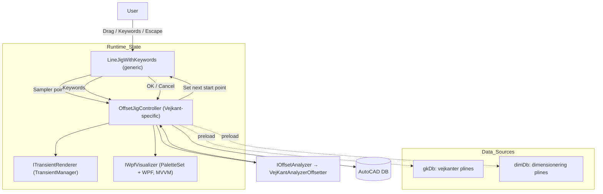

## Vejkant Offset — Continuous Jig, Live Analysis, and MVVM UI

This document is the single source of truth for the continuous jig workflow, live offset preview, and WPF visualization for Vejkanter analysis. It is designed to be LLM-friendly: concise sections, clear contracts, and diagrams.

### Core goals
- Keep the jig generic and reusable; do not create a new jig type dedicated to Vejkanter.
- Add continuous operation: every committed end point seeds the next segment start.
- On every sampler move, run `VejKantAnalyzerOffsetter` and show a live offset polyline via AutoCAD Transient graphics.
- First Escape returns to “Select first point”; second Escape exits.
- Provide a WPF MVVM visualizer (CommunityToolkit) that shows the jigged line and the vejkanter it crosses.
- Encapsulate Vejkant-specific logic in `VejkantOffset/` and keep `Jigs/LineJigWithKeywords<TContext>` task-agnostic.

---

### High-level architecture



Key principle: Jig remains agnostic. Vejkant logic lives entirely in the controller and collaborators.

---

### Responsibilities and contracts

- Jig: `LineJigWithKeywords<TContext>` (existing, generic)
  - Provides a continuous workflow by reusing the end point as the next start point.
  - Exposes extensibility via optional callbacks (no Vejkant dependencies):
    - `OnSamplerPointChanged(Point3d start, Point3d end)`
    - `OnKeyword(string keyword)`
    - `OnCommit(Line line)` — user confirms end point
    - `OnCancelLevel1()` — return to start-point prompt
    - `OnCancelLevel2()` — exit jig
  - Note: We can implement these as constructor-injected delegates or an interface `ILineJigCallbacks` to avoid tight coupling.

- Controller: `OffsetJigController` (Vejkant-specific)
  - Preloads and caches geometry from `gkDb` and `dimDb` for fast analysis (2D segments, ObjectIds, etc.).
  - On every sampler tick, converts the work line to 2D and calls `IOffsetAnalyzer`.
  - Pushes a preview (offset polyline + helpers) to `ITransientRenderer`.
  - Sends a snapshot DTO to the WPF visualizer for schematic rendering.
  - On commit: adds the resulting offset polyline to the DB (colors, layers) and seeds next start.
  - On cancel L1: clears preview and returns to start-point selection.
  - On cancel L2: full cleanup and dispose.

- Analyzer: `IOffsetAnalyzer` → adapter over `VejKantAnalyzerOffsetter`
  - Stable contract for analysis; internally uses `VejKantAnalyzerOffsetter.CreateOffsetPolyline(Line, IEnumerable<Polyline>, VejkantOffsetSettings)`.
  - Enables testing/mocking and future replacement.

- Renderer: `ITransientRenderer`
  - Draws transient preview of the current jig line, computed offset polyline, and optional helpers (stations, normal hops).
  - Provides `Show(PreviewModel)` and `Clear()`.

- Visualizer: `IWpfVisualizer` (PaletteSet-hosted WPF)
  - MVVM with CommunityToolkit. Receives simple DTOs describing the current sampler state and intersections.
  - Renders a longitudinal schematic similar to the provided image.

---

### Proposed folder structure (all Vejkant-specific under `VejkantOffset/`)

```
VejkantOffset/
  App/
    OffsetJigController.cs
    Contracts/
      IOffsetAnalyzer.cs
      ITransientRenderer.cs
      IWpfVisualizer.cs
      PreviewModel.cs
      SamplerSnapshot.cs
  Core/
    Analysis/
      VejKantAnalyzerOffsetter.cs
    Models/
      SegmentHit.cs
    Settings/
      VejkantOffsetSettings.cs
  Rendering/
    TransientPreviewRenderer.cs
  UI/
    Views/
      OffsetPaletteView.xaml
      OffsetPaletteView.xaml.cs
    ViewModels/
      OffsetPaletteViewModel.cs
    Converters/
    Resources/
```

Notes:
- Generic jig stays in `Jigs/` as `LineJigWithKeywords<TContext>`. We may rename to `ContinuousLineJig<TContext>` only if it clarifies intent, but it must remain task-agnostic.
- Existing files will be moved into `Core/Analysis`, `Core/Models`, and `Core/Settings` accordingly.

---

### Key API sketches (C# signatures only)

```csharp
// Jigs/LineJigWithKeywords.cs (generic)
public interface ILineJigCallbacks
{
    void OnSamplerPointChanged(Point3d start, Point3d end);
    void OnKeyword(string keyword);
    void OnCommit(Line line);
    void OnCancelLevel1();
    void OnCancelLevel2();
}

// Optional in constructor; null-safe
public LineJigWithKeywords(Line line,
    IEnumerable<LineJigKeyword<TContext>>? keywords,
    TContext context,
    ILineJigCallbacks? callbacks = null);

// VejkantOffset/App/Contracts
public interface IOffsetAnalyzer
{
    Polyline? Analyze(Line workingLine, VejkantOffsetSettings settings,
                      IEnumerable<Polyline> dimPlines, IEnumerable<Polyline> gkPlines,
                      out SamplerSnapshot snapshot);
}

public interface ITransientRenderer
{
    void Show(PreviewModel model); // line + offset + helpers
    void Clear();
}

public interface IWpfVisualizer
{
    void Show();
    void Update(SamplerSnapshot snapshot);
    void Hide();
}
```

---

### MVVM (WPF) with CommunityToolkit

- NuGet: `CommunityToolkit.Mvvm`.
- ViewModel: `OffsetPaletteViewModel`
  - Observable properties: `CurrentLength`, `ChosenSide`, `Groups`, `OffsetsDistinct`, `MouseStation`, etc.
  - Commands: `ToggleHelpers`, `ToggleSide`, `ZoomToSegment`.
- View: `OffsetPaletteView.xaml`
  - Draws schematic using either `Canvas` or a lightweight items control.
  - Pure bindings; no code-behind logic beyond view plumbing.
- Controller updates ViewModel via `IWpfVisualizer.Update(SamplerSnapshot)`.

---

### Interaction rules

- Continuous jig:
  - First invocation: prompt for start.
  - As user moves, sampler triggers `OnSamplerPointChanged` → analyze → render preview → update UI.
  - On OK: `OnCommit` → commit DB polyline, start next segment from last end.
  - On Esc: first → `OnCancelLevel1` (reset to start prompt, clear preview); second → `OnCancelLevel2` (full exit & cleanup).

---

### Milestones

1) Wiring and contracts
   - Add `ILineJigCallbacks` to existing jig; implement two-level cancel behavior.
   - Create `OffsetJigController` and contracts (analyzer adapter, renderer, visualizer).

2) Live preview
   - Implement `TransientPreviewRenderer` (line + offset polyline, yellow/red colors as current code).
   - Preload and cache `gkDb` and `dimDb` polylines once per session.

3) Analyzer integration
   - Wrap `VejKantAnalyzerOffsetter` with `IOffsetAnalyzer`; return both `Polyline?` and a `SamplerSnapshot` DTO for the UI.

4) MVVM UI
   - PaletteSet host, `OffsetPaletteView` + `OffsetPaletteViewModel` using CommunityToolkit.
   - Render schematic like the reference image.

5) Persistence & polish
   - Commit behavior, color/layer rules, settings binding, keyword handlers.
   - Performance profiling on large drawings; throttle sampler updates if needed.

---

### Risks / mitigations

- Performance under frequent sampler ticks → Cache geometry; minimize DB access; use 2D math; throttle to ~20–30 Hz if needed.
- Transient lifetime leaks → Centralized renderer with `Clear()` on every tick and `Dispose` on exit.
- UI thread marshaling → Use dispatcher-safe updates and light DTOs.

---

### Open questions

- Should we rename the jig to better reflect continuous behavior while staying generic? Proposal: keep name and add callbacks.
- Exact layer/color rules for committed offset polylines (document current conventions?).

---

### Update protocol

- Keep this file updated after each milestone.
- Record any API changes to jig callbacks or controller contracts.
- Note any deviations from folder structure.


